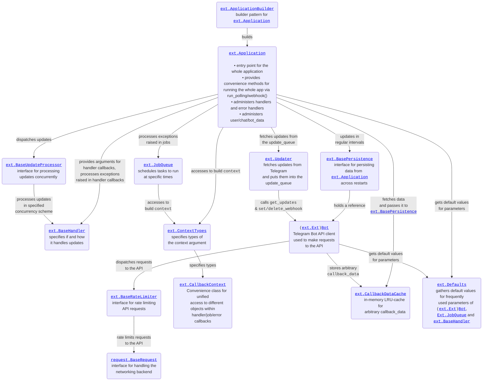

# Architecture

The `telegram` and `telegram.ext` packages contain several classes that make writing (chat)bots easy.
You have met most of them in the [[tutorial|Extensions---Your-first-Bot]].
Because all of that can be a bit overwhelming, the below diagram gives you an overview of how the different components interact with each other.

---

`python-telegram-bot` is designed such that you can adjust it to many use cases.
In particular, many components/features are optional and some can even be fully customized.
Moreover, the design allows the library to be used alongside other `asyncio` frameworks in the same Python script. We have a dedicated section on this in the [over here](../wiki/Frequently-requested-design-patterns#running-ptb-alongside-other-asyncio-frameworks).

## Fetching updates

The `Updater` class is there to fetch updates from the Bot API for your bot.
But you don't need to use it.
If you want to implement a custom mechanism to fetch updates (e.g. a [[custom webhook setup|Webhooks]], you can just put your updates into the `Application.update_queue` or even manually call `Application.process_update`.
To build an `Application` that doesn't use an `Updater`, simply pass `None` to `ApplicationBuilder.updater`.

## Concurrent update processing

By default, the `Application` handles updates sequentially, i.e. one by one.
However, you can also process updates concurrently, i.e. multiple updates at the same time.
It is also possible to customize which updates should be processed concurrently and which should be processed sequentially by providing a custom implementation of the `BaseUpdateProcessor` interface class.
Please have a look at [[this wiki page|Concurrency]] for more info.

## Scheduling tasks

The `JobQueue` class integrates scheduling logic into the setup of `telegram.ext`.
This feature is optional.
If you don't need/want to use a `JobQueue`, simply pass `None` to `ApplicationBuilder.job_queue`.

## Arbitrary `callback_data`

The `CallbackDataCache` is the backend for caching arbitrary `callback_data`.
This feature must be explicitly activated to be used.
Please see [[this wiki page|Arbitrary-callback_data]] for more info.

## Default values

The `Defaults` class allows you to specify default values for parameters that appear quite often, e.g. the `parse_mode` parameter.
This is an opt-in feature.
Please have a look at [[this wiki page|Adding-defaults-to-your-bot]] for more info.

## Persisting data across restarts

By default, data like `Application.{chat, bot, user}_data` is stored in-memory and is lost when the bot shuts down.
PTB includes an optional functionality to persist data across restarts, which has `BasePersistence` as interface class at it's core.
Head to [[this page|Making-your-bot-persistent]] for more info.

## Rate limiting

By default, all requests to the bot API, i.e. calling `Bot.send_message`, `Message.reply_text` or any other API method, are immediately forwarded to Telegram.
Since Telegram imposes rate limits, this can lead to flood errors if you're making to many requests in a short time span.
PTB includes an optional functionality to "throttle" the outgoing requests, which has `BaseRateLimiter` as interface class at it's core.
Head to [[this page|Avoiding-flood-limits]] for more info.

## Networking

By default, PTB will use the `httpx` library for the networking backend, i.e. making requests to the Bot API.
However, you are free to use a custom backend implementation as well.
For this, you'll have to implement the `BaseRequest` interface class and pass two instances of your custom networking class to
`ApplicationBuilder.request` and `ApplicationBuilder.get_updates_request`.

## Update handlers

The `Handler` interface class is the most important class when it comes to the question of how the `Application` processes updates.
PTB comes with a number of [[built-in handler|Types-of-Handlers]] which cover most important use cases.
However, if you want to implement a custom logic of when an update should be handled, you can also write a custom implementation of `Handler` and use that.

## Persistence

As mentioned above, PTBs persistence functionality is based on the interface class `BasePersistence`.
To use persistence in PTB, you use an implementation of this class.
PTB comes already ships two implementations (see [[this page|Making-your-bot-persistent]]), but you are very welcome to implement a persistence class for your own serialization backend.

## Customizing the `context` parameter

The class `CallbackContext` is a central part of the handler/job callbacks in PTB and more advanced users may want to add custom behavior to this class.
You can do so by passing an instance of the `ContextTypes` to `ApplicationBuilder.context_types`.
Have a look at [this example](https://docs.python-telegram-bot.org/examples.html#examples-contexttypesbot) for example use cases.